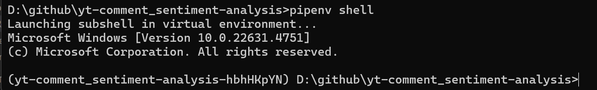
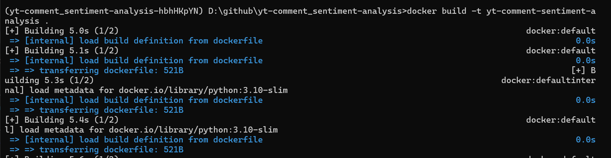
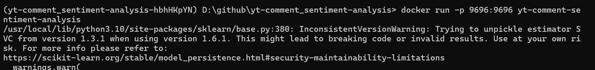
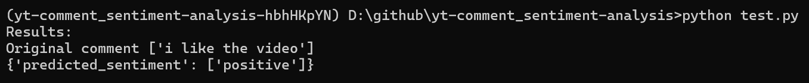

<h2 align="center">Youtube Comment Sentiment Analysis</h2>

<!-- ABOUT THE PROJECT -->

## About The Project

This is project for capstone 2 in MLZoomcamp 2024. The project is about sentiment analaysis from comments on youtube. Source of the dataset:

[dataset](https://www.kaggle.com/datasets/atifaliak/youtube-comments-dataset)

The dataset contain features **Comment** and **Sentiment**. Comment for the original text while **Sentiment** for their classification [positive, neutral, or negative]

The aim of this project is to classify the comment to that 3 classes This will be useful for anyone who uploaded video on youtube to get to know the respond of watchers.

- For EDA and model training (and selection), can be found in `Notebook.ipynb`,
- Training of the final model is in the `train.py` script.
- And the deployment for model is in the `predict.py`. The model deployed as web service using Flask in a Docker container.

## Data Preprocessing 

What I tried are finding missing value and it has 44. I decided to delete it because it only a few from the total of dataset and then also trying to visualize the classes, find text_length, find word frequency on positive and negative sentiment and finding bigrams

## Model Training and Selection

I did try multiple models (logistic regression, random forest and SVM or we can call it SVC) with trying different parameter.

The model that I choose is **SVM** with results is 0.77 on test data


## How to run this project

1. First, you can clone the repo using the following command:

```sh
   git clone https://github.com/rahmaha/mlzoomcamp-midterm.git
```

or click at the `code button` and chose download zip

2. To run the project, you need to have python, jupyter notebook and pipenv in your computer/laptop. This project also has a few of packages that needed that detailed in Pipfile/Pipfile.lock. To install all these packages, you can use pipenv to create separete environtment for this project. Make sure you already installed it or if not you can run this command:

```sh
   pip install pipenv
```

Then open terminal and go to the path of folder which contain this project (Pipfile/Pipfile.lock), and then run this command to install all packages needed:

```sh
   pipenv install
```

3. Now that you already installed it, you can start using this new virtual environtment for this project, run this following command to activate it:

```sh
   pipenv shell
```


4. Next is run the scripts like you normally do.

<!-- How to submit request -->

## How to submit request 

This project only deployed on docker, because of that you need to have docker installed on your laptop. 
- first build docker image
`docker build -t yt-comment-sentiment-analysis .`



- second run docker image
`docker run -p 9696:9696 yt-comment-sentiment-analysis`



- third open new terminal, run pipenv shell on the same path
- fourth type `python test.py`. test.py has the text that I want to test. You can change the text too if you want to try

